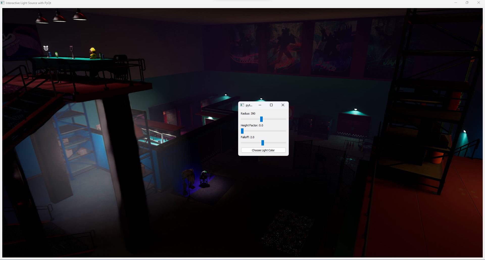

# Re-light Project

## Introduction
Re-light is an innovative project that enables the dynamic creation of light sources on images, providing a highly interactive and intuitive way to manipulate lighting and shadows. Built around the core file `game.py`, Re-light leverages advanced algorithms to remove shadows, calculate depth using `Intel/dpt-large`, and accurately position light sources with consideration to existing shadows. This document serves as a guide to setting up and utilizing the Re-light project.

## Project Structure
Re-light operates primarily through `game.py`, a PyQt5 application that offers a graphical interface for users to interact with images. However, for full functionality, the project relies on a separate service, defined in `gradio_serv_main.py`, which hosts a Gradio-based web interface for processing image effects and depth estimation.

## Dependencies
- PyQt5: For the graphical user interface.
- Pillow (PIL): For image manipulation.
- NumPy: For numerical operations on images.
- Requests: For making HTTP requests to the Gradio service.
- Gradio: For creating the web interface for image processing and depth estimation.
- Torch: For loading and using machine learning models.
- Transformers: For the depth estimation model `Intel/dpt-large`.

## Setup
1. **Install Dependencies**: Ensure Python is installed on your system. Install all required Python packages using pip:
   ```
   pip install PyQt5 Pillow numpy requests gradio torch transformers
   ```
2. **Prepare the Model**: Download the `shadowRM2.pth` model file and place it in the project directory. This model is essential for the shadow removal feature.

3. **Launch the Gradio Service**: Run `gradio_serv_main.py` to start the backend service required for image processing and depth estimation. Ensure this service is running before starting the main application.

4. **Run Re-light**: Execute `game.py` to launch the Re-light application. The interface allows you to choose an image and dynamically add light sources to it.

## Features
- **Dynamic Light Sources**: Users can add light sources to images by clicking on the desired location within the image. The intensity, radius, and color of the light can be adjusted through the interface.
- **Depth Estimation**: Utilizes the `Intel/dpt-large` model to estimate the depth of each pixel in the image, allowing for realistic placement of light and shadows.
- **Shadow Removal**: Employs a specialized algorithm to remove existing shadows from the image, providing a clean slate for adding new light sources.

## Usage
- **Adding Light**: Simply click on the image where you want to place the light source. Adjust the properties of the light using the sliders and color picker in the control panel.
- **Adjusting Light Properties**: Use the radius, height factor, and falloff sliders to fine-tune the appearance of the light source. The color button allows you to change the light's color.
- **Reprocessing Images**: The Gradio web service can be used to reprocess images with different effects, such as adjusting brightness, contrast, and more.



## Note
The Re-light project combines the power of desktop and web-based applications to provide a unique tool for image editing. By manipulating light and shadow in images, users can achieve highly realistic and creative effects, making it an excellent tool for photographers, designers, and enthusiasts alike.

## Contributing

Contributions are welcome! If you have suggestions for improving this project, feel free to open an issue or a pull request.

## License

All code provided in this repository is released under the MIT License. Please note that third-party AI models and libraries used may be subject to their own licenses.
